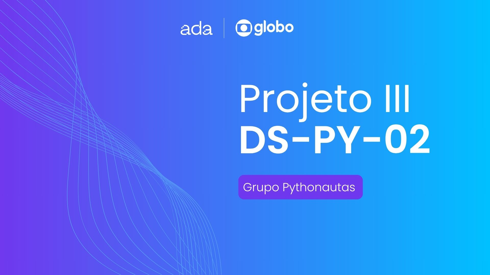
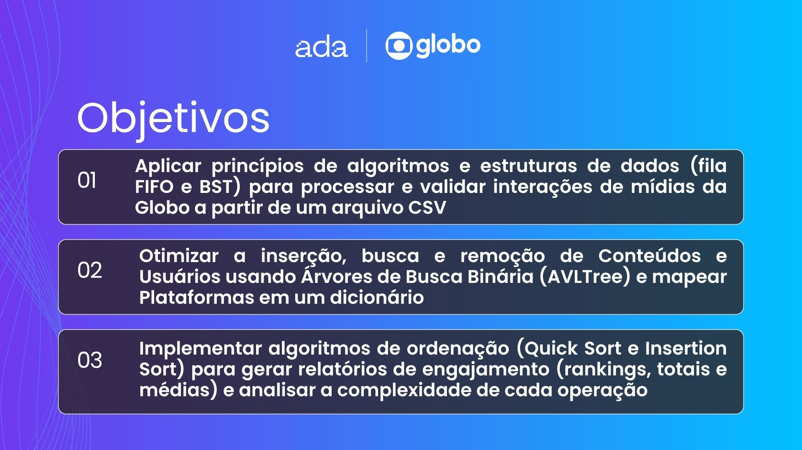
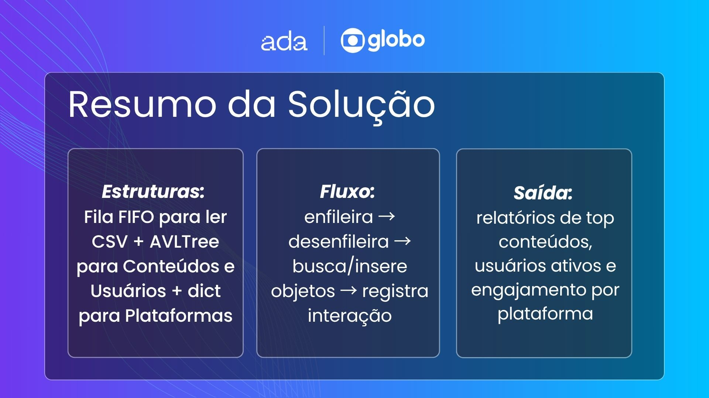
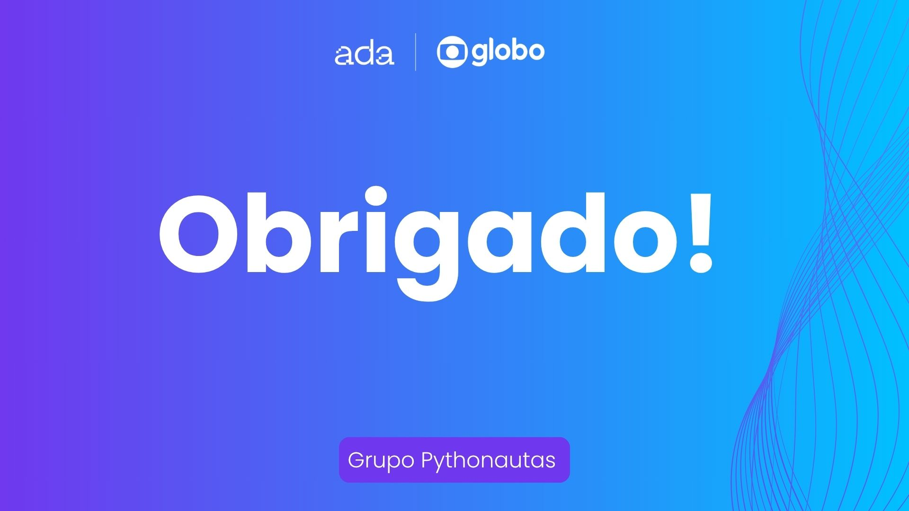

# 📊 Projeto III - Ada x Globotech  
### Análise de Engajamento com Estruturas de Dados

Este repositório contém a implementação do terceiro projeto da parceria **Ada Tech x Globotech**, com foco na aplicação de **estruturas de dados fundamentais** para análise de dados de engajamento em mídias digitais do grupo Globo.

---

## 🎯 Objetivo

Utilizar **filas** e **árvores de busca binária** para processar e organizar os dados de interações de usuários com conteúdos em plataformas Globo, simulando o uso de algoritmos e estruturas que otimizam o desempenho de sistemas reais.

---

## 🔍 Descrição do Projeto

- Carregamento de dados utilizando uma **estrutura de fila** (FIFO), para simular o fluxo contínuo de interações.
- Armazenamento e gerenciamento de objetos `Conteudo` e `Usuario` com **árvores binárias de busca**, permitindo busca, inserção e remoção eficientes.
- Geração de **relatórios de engajamento**, como:
  - Top conteúdos mais assistidos
  - Usuários mais ativos
  - Conteúdos mais comentados
  - Engajamento por plataforma
- Implementação de **algoritmos de ordenação** (como Quick Sort e Insertion Sort) nas análises.
- Análise da **complexidade algorítmica** (tempo e espaço) das soluções implementadas.

---

## 🗂️ Estrutura Geral

O projeto segue uma arquitetura modular, com organização em pacotes como `entidades/`, `estruturas_dados/`, `analise/` e um ponto de entrada principal em `main.py`.

---

## 👥 Colaboradores

Este projeto foi desenvolvido em equipe como parte do desafio prático da trilha de Estruturas de Dados da Ada Tech:

- [@falk-dev](https://github.com/falk-dev)  
- [@aliceochoa](https://github.com/aliceochoa)  
- [@Williannca85](https://github.com/Williannca85)  
- [@devrsmenezes](https://github.com/devrsmenezes)  
- [@isabelacmaia](https://github.com/isabelacmaia)
- [@ugabiraposo](https://github.com/ugabiraposo)

---

## 📑 Apresentação & Review
Abaixo você encontra os slides que apresentamos durante nossa entrega: os objetivos de aprendizagem, o resumo e a solução proposta, os principais desafios que enfrentamos e, por fim, nossos agradecimentos.

---

## 📝 Observações

Este repositório representa nosso progresso prático na disciplina **DS-PY-003 - Introdução a Algoritmos e Estruturas de Dados**, com foco em design algorítmico, uso eficiente de estruturas de dados e análise de performance.

---

> _"Não basta funcionar. Também precisa ser eficiente."_ 💡
